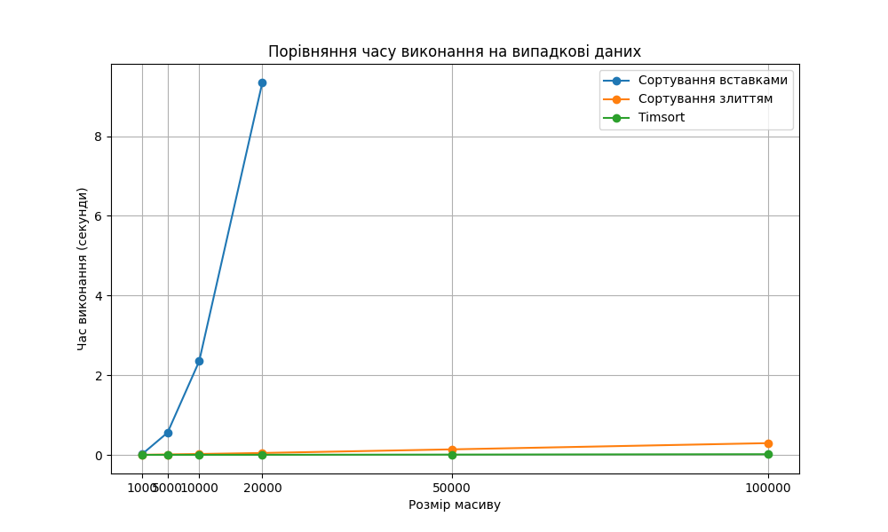
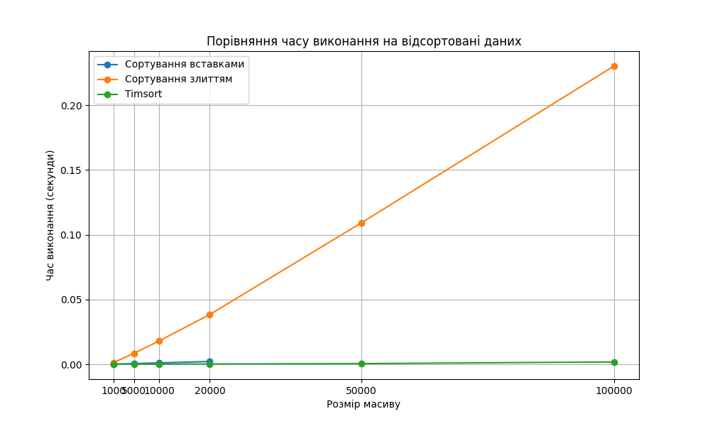

# goit-algo-hw-04
## Тема 4. Алгоритми сортування

Перед початком роботи:
1. Версія **Python: >=3.10**
2. Cтворюємо віртуальне середовище (Python: >=3.10) `.env`: `python -m venv .env`
3. Активуємо (відповідно до своєї ОС): `source .env/bin/activate`
4. Інсталюємо залежності: `pip install -r requirements.txt`
5. По завершенню роботи деактивовуємо: `deactivate`

## Завдання 1
`Python` має дві вбудовані функції сортування: `sorted` і `sort`. Функції сортування `Python` використовують `Timsort` — гібридний алгоритм сортування, що поєднує в собі сортування злиттям і сортування вставками.

Порівняйте три алгоритми сортування: злиттям, вставками та `Timsort` за часом виконання. Аналіз повинен бути підтверджений емпіричними даними, отриманими шляхом тестування алгоритмів на різних наборах даних. Емпірично перевірте теоретичні оцінки складності алгоритмів, наприклад, сортуванням на великих масивах. Для заміру часу виконання алгоритмів використовуйте модуль [timeit](https://docs.python.org/uk/3/library/timeit.html).

Покажіть, що поєднання сортування злиттям і сортування вставками робить алгоритм `Timsort` набагато ефективнішим, і саме з цієї причини програмісти, в більшості випадків, використовують вбудовані в Python алгоритми, а не кодують самі. Зробіть висновки.

### Критерії оцінювання:
- Виконано порівняльний аналіз алгоритмів за часом виконання шляхом їх тестування на різних наборах даних.
- Емпірично перевірено теоретичні оцінки складності алгоритмів та доведено, що поєднання сортування злиттям і сортування вставками робить алгоритм `Timsort` набагато ефективнішим.
- Зроблено висновки щодо ефективності алгоритмів для даного випадку. Висновки оформлено у вигляді файлу readme.md до домашнього завдання.
### Висновки
Проведений порівняльний аналіз трьох алгоритмів сортування (сортування вставками, сортування злиттям та Timsort) на різних наборах даних (випадкові, відсортовані та зворотно відсортовані) дозволяє зробити наступні висновки:
- Сортування вставками є ефективним для малих та вже відсортованих масивів завдяки часовій складності $O(n)$ у найкращому випадку. Проте для великих та зворотно відсортованих масивів його продуктивність значно погіршується до $O(n^2)$, що робить його непридатним для таких задач.
- Сортування злиттям має стабільну продуктивність з часовою складністю $O(n \log n)$, яка не залежить від початкового стану даних. Це робить його хорошим вибором для сортування великих масивів з випадковим впорядкуванням.
- Timsort поєднує переваги сортування вставками та сортування злиттям, що дозволяє йому досягати високої ефективності на реальних даних, які часто містять частково відсортовані послідовності. Він демонструє найкращу продуктивність на відсортованих та випадкових даних, і лише трохи поступається сортуванню злиттям на зворотно відсортованих масивах.

Таким чином, використання вбудованого алгоритму Timsort в Python є найкращим вибором для більшості задач сортування, що підтверджується як теоретичними оцінками, так і емпіричними результатами. Детальніше: [task1.ipynb](./task1.ipynb).




### Ресурси
- [task1.ipynb](./task1.ipynb)
- [task1.py](./task1.py)
- [Module helpers](./helpers)

## Завдання 2
Дано `k` відсортованих списків цілих чисел. Ваше завдання — об'єднати їх у один відсортований список. При виконанні завдання можете опиратися на алгоритм сортування злиттям з конспекту. Реалізуйте функцію `merge_k_lists`, яка приймає на вхід список відсортованих списків та повертає відсортований список.

Приклад очікуваного результату:
```
lists = [[1, 4, 5], [1, 3, 4], [2, 6]]
merged_list = merge_k_lists(lists)
print("Відсортований список:", merged_list)
```
Виведення:
```
Відсортований список: [1, 1, 2, 3, 4, 4, 5, 6]
```

### Ресурси
- [task2.py](./task2.py)
- [Module helpers](./helpers)

## Додатково
- [Домашнє завдання до теми “Алгоритми сортування”](https://www.edu.goit.global/uk/learn/24858703/19646173/19656826/homework)
- [https://github.com/nickolas-z/goit-algo-hw-04](https://github.com/nickolas-z/goit-algo-hw-04)
- [goit-algo-hw-04-main.zip]()
- [Basic-Algorithms-and-Data-Structures-Neoversity](https://github.com/nickolas-z/Basic-Algorithms-and-Data-Structures-Neoversity)